# Introduction

Sailor Hat with ESP32 (SH-ESP32) is a powerful microcontroller development board for marine environments.

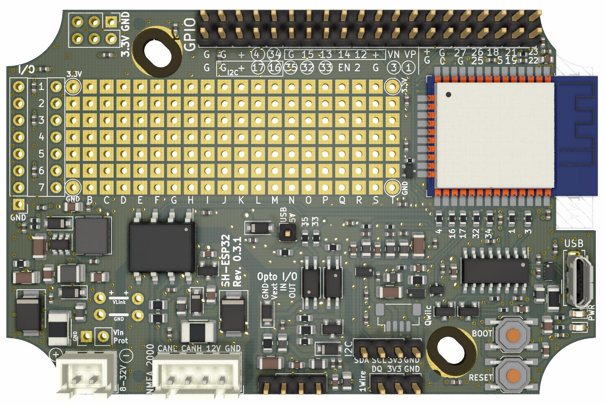
*Figure 1. SH-ESP32 top view.*

With SH-ESP32 you can easily create all kinds of sensors and control interfaces for your boat.
Examples include RPM or fuel and water tank level meters, bilge alarms, chain counters, electrical compasses, attitude sensors, and so on.
Control interface examples include automatic engine room blower control, smart light switching, or smart fridge thermostats.
It integrates easily both to [Signal K](https://signalk.org/) as well as NMEA 2000 and can be used as a NMEA 2000 gateway device.

SH-ESP32 can be plugged directly to any 12V or 24V power system. 
Special emphasis has been placed on electrical compliance: the board can handle most power surges present on an automotive or marine 12V or 24V power system.
Equally importantly, the inputs and outputs have protection for electrostatic discharges (static electricity), and are designed to not produce electromagnetic emissions (disturb other sensitive devices such as VHF radios or GPS antennas), and to be protected against electromagnetic interference (will not be disturbed by a VHF, SSB, or a radar).

SH-ESP32 is open hardware, licensed under the Creative Commons Attribution-ShareAlike 4.0 International license.
You can create your own SH-ESP32 derivatives as long as you share them under similar terms!

# Getting started
## Getting the hardware

Ready-made CE-certified SH-ESP32 boards can be purchased from [Hat Labs Ltd](https://hatlabs.fi).
All design files are also available at the [SH-ESP32 hardware GitHub repository](https://github.com/hatlabs/sh-esp32-hardware/).

## Assembling the hardware

The SH-ESP32 boards sold by Hat Labs are mostly unassembled.
Only the USB connector has been soldered on at delivery.
You need to solder on the remaining connectors, or at least the ones you need.
A set of connectors is provided in the sales package.
Depending on your requirements, you may want to swap them for something else.
For example, the power and CAN bus connectors can be replaced with 2.5 mm pluggable terminal blocks that permit easier disconnection of individual wires and is mechanically sturdier.
Similarly, male headers may be replaced with female ones to allow plugging in devices with compatible male headers.

To assemble the connectors, a soldering iron and some solder is required.
It is highly recommended to use an iron with controllable temperature.
Flux can also be helpful.
SH-ESP32 has ground plane on up to three of the four PCB layers.
They conduct heat efficiently away from the solder joint -- to solder the connectors, use as large solder tip as you can easily work with.
It also helps to set the iron temperature somewhat higher than usually; 370°C or 700°F is a good starting point.

To solder the connectors, place them on the board one by one and use some tape to hold them in place when you turn the PCB around for soldering. Male header pins can be pushed through the tape for even easier manipulation.

Touch both the pin and the pad with the iron tip and then feed some solder wire to the opposite side of the pin, as shown in Figures [2](#fig_soldering_guide_1) and [3](#fig_soldering_guide_2).
The whole process should ideally take only a couple of seconds, although in practice some fumbling is normal.
Try avoiding heating the pins too long, though -- the plastic connector or header body will melt and the pin will become crooked.
Tiny deformation is not dangerous, though, as long as it doesn't prevent you from plugging the connector to the header.

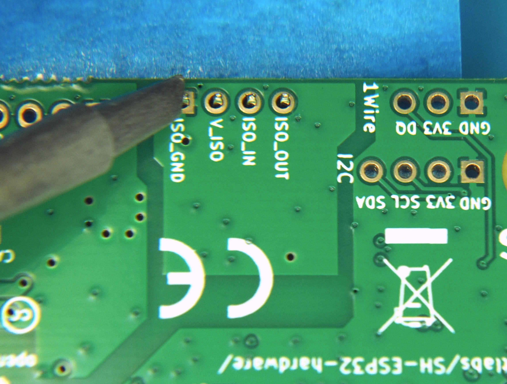
*Figure 2. Hold the soldering iron tip against both the pin and the pad.*

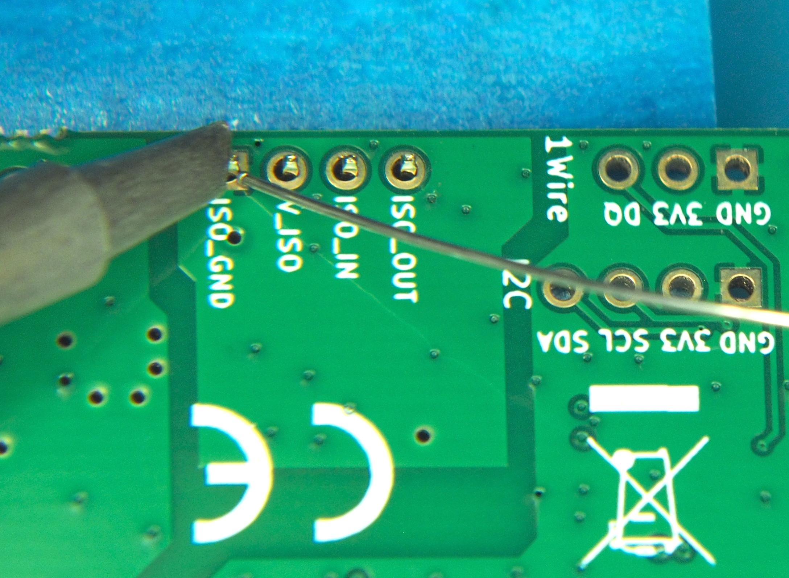
*Figure 3. Feed the soldering iron to the heated pin and the pad, not to the iron tip.*

A bit of solder on the iron tip is OK for helping with heat transfer, but if you add a big blob of solder onto the tip, all flux burns off and the solder becomes difficult to work with.
In that case it's better to wipe the tip clean and apply some fresh solder.
For stubborn pins add a generous amount of flux.
It helps the solder flow more easily.

The end result should be as shown in [Figure 4](#fig_soldering_guide_3).

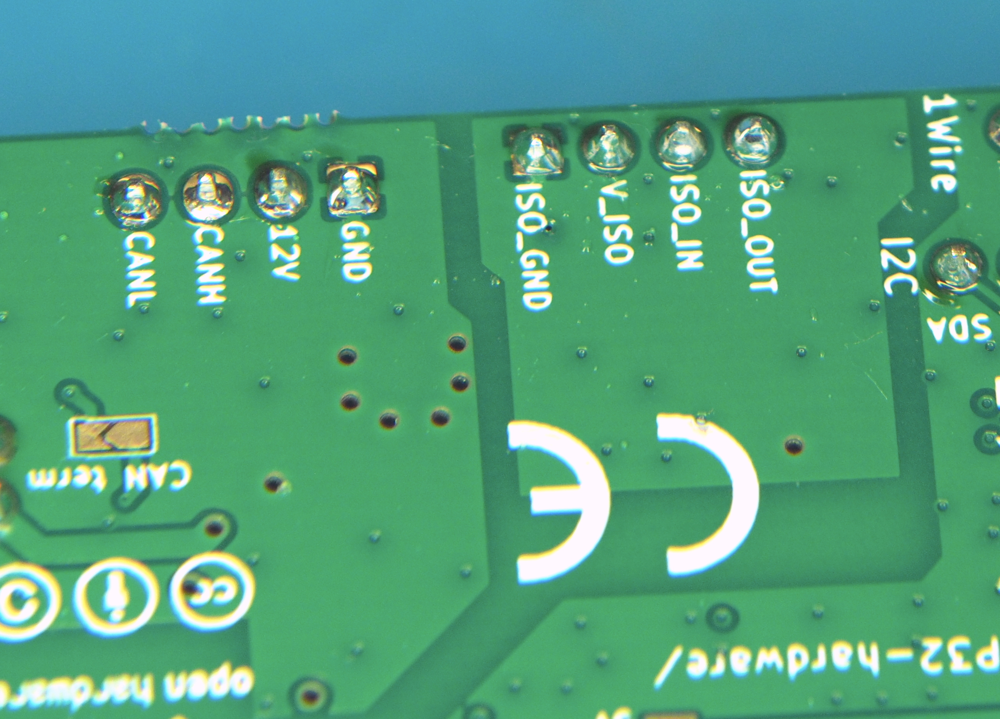
*Figure 4. The solder has flown nicely to both the pad and the pin and is smooth and shiny.*

## Enclosures

Boats can be nasty environments for electronics; there's salt water, high humidity, and often some condensation, too.
It is highly recommended to keep the SH-ESP32 in an enclosure in "production".
The board has been designed to fit in an 100x68x50 mm plastic waterproof enclosure as shown in Figure [5](#fig_enclosure), available either at the Hat Labs web store, or at any online marketplace such as Amazon, Ebay, or AliExpress.

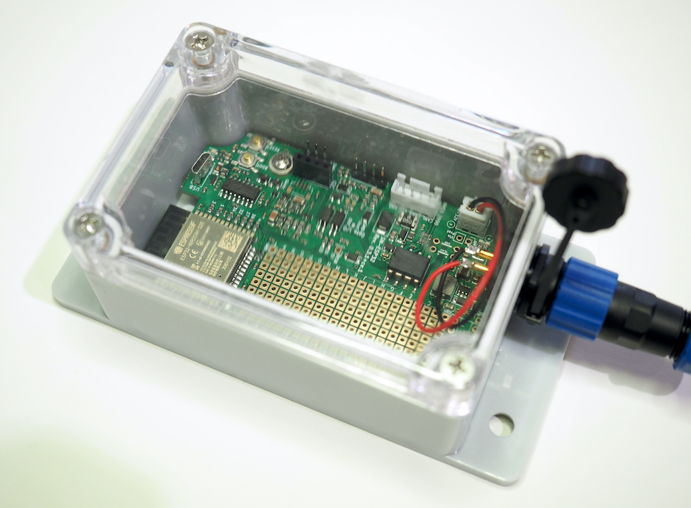
*Figure 5. SH-ESP32 in a standard 100x68x50 mm enclosure.*

### Mounting the board

There is some slight variation in the location of the plastic standoffs on generic enclosures, so you might have to get creative when mounting the board.
Plastic adhesive standoffs (3 mm hole size, height 6 mm or less, available online) such as the ones shown in [Figure 6](#fig_adhesive_pcb_standoffs) allow you to mount the board easily in any kind of an enclosure.

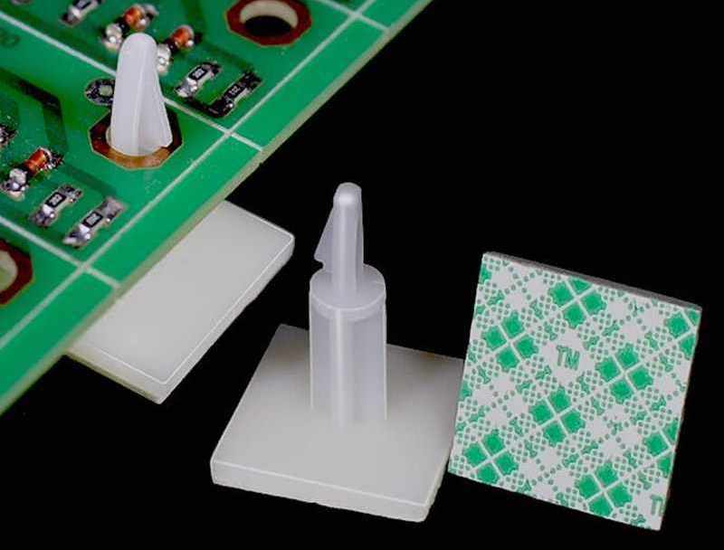
*Figure 6. Adhesive PCB standoffs can be used to mount SH-ESP32 in any size enclosure.*

### Drilling holes

The enclosures don't have any pre-drilled holes for connectors or wire glands on them.
At a very minimum, you need one hole for power or NMEA 2000 input.
Usually you want some more, though, to connect external sensors or wiring.

To drill the holes in the thin plastic, a step drill bit (one that looks like a small metal Christmas tree), such as the ones shown in Fig. 7, is recommended. 
Standard metal drill bits may easily bite too hard and crack the plastic.
If you don't have a step drill bit at hand, use standard metal bits.
Start with a small diameter and increase the diameter with small increments to limit the risk of cracking the case.

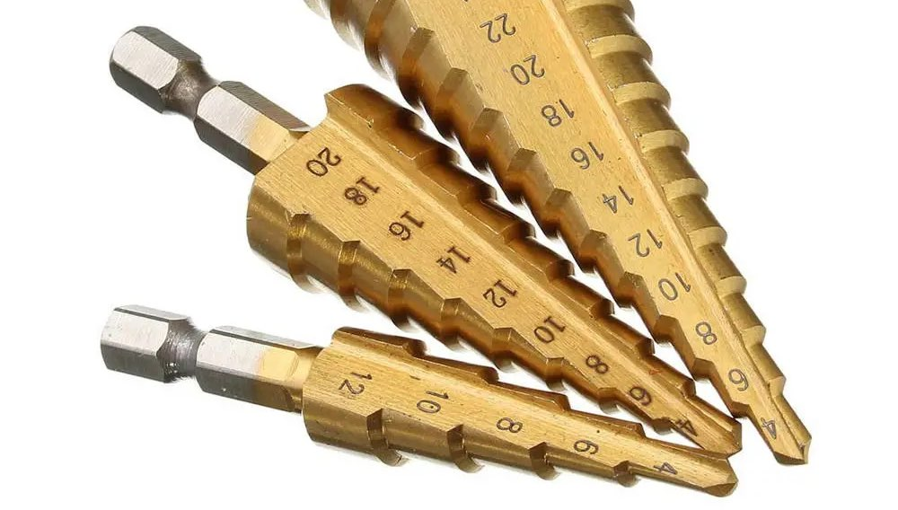
*Figure 7. Step drill bits are recommended for drilling holes in thin plastic.*

Plan your hole placement in advance.
If you only need a couple of holes, placing them on the short side may result in the neatest outcome.
If you need three or more connectors, place them on the long side or on both ends.
Nothing prevents you from adding connectors on the lid, either.
If there is even the slightest possibility of condensation or deck leaks or any other water drops near the planned installation location, try to have the connectors leave the enclosure downwards.
This should prevent any water ingress even if the connectors weren't perfectly tight.

When placing the holes horizontally, make sure that the connector nut will clear both the enclosure corner bumps and the nut of any adjacent connector. Vertically, the connector should be as high as reasonable. This will help the connector clear any headers or components on the PCB.
The hole edge could be 4-5 mm or 3/16" from the lid seam.
When using PG9 cable glands, the hole might have to be even closer to the lid.
Drill carefully!

Suitable hole size for different connectors:

- SMA (WiFi antenna): 6.5-7 mm or 1/4"
- PG7 cable gland and M12 (NMEA 2000) panel connector: 12 mm or 1/2"
- SP13 panel connectors (blue-black plastic connectors): 13-14 mm.
  1/2" probably works with a bit of wiggling.
- PG9 cable gland: 16 mm or 5/8"

TODO: Illustrations

### Soldering the panel connectors

When soldering the internal wires to the panel connectors, always use heat shrink tube on the individual wires.
Always remember to slide the heat shrink on the wires _before_ soldering...
When soldering the panel connectors, the general guidance given in Section FIXME applies.
Usually you can first add solder to the connector pin cavity and then re-melt the solder and insert the wire.

# Hardware description

## Tour around the board

The different functional blocks of SH-ESP32 are shown in [Figure 8](#fig_functional_blocks).
They are described below.

1. **The ESP32-WROOM-32 module**: 
   The ESP32 microcontroller module is the heart of the device.
   It contains the two-core microcontroller with integrated RAM, a flash chip, and a WiFi/Bluetooth antenna (or, in the case of SH-ESP32-ufl, a U.FL connector for the antenna).

2. **Power supply**:
   SH-ESP32 has an integrated switching mode power supply that converts input voltages between 8V and 32V to the 3.3V voltage used on the board. 
   The power supply also includes a self-resetting 500 mA polyfuse, reverse polarity protection, and surge protection.

3. **CAN bus transceiver**:
   SH-ESP32 includes an isolated CAN transceiver that conforms to the NMEA 2000 specification.
   The CAN bus circuitry also includes protection similar to the main power supply and a 5V linear regulator to power the transceiver independently from the NMEA 2000 bus.

4. **Optocoupler input and output**:
   Optocoupler I/O can be used to connect the SH-ESP32 safely to noisy external inputs or outputs such as the alternator signal or relays. 
   
5. **I2C and 1-Wire I/O**:
   SH-ESP32 supports 1-Wire and I2C on separate 2.54 mm headers.
   Additionally, there is an unpopulated footprint for a Qwiic compatible JST SH connector.
   Both interfaces are ESD protected and have noise filtering.

6. **USB interface**:
   SH-ESP32 has a USB 2.0 compatible Micro B connector and interface.
   When connected to a host computer, the board is visible as a USB serial device.
   The USB interface can be used for powering the board, flashing the ESP32 module, and for communicating with the device using a serial protocol.

7. **User interface**:
   There are two buttons and two leds integrated on the board.
   The reset button resets the board.
   The boot button can be used to force the ESP32 into a flashing mode, and otherwise is usable as a generic button input on GPIO0.
   The red LED is hard-wired to the 3.3V power, indicating that the device is powered, while the blue LED is connected to GPIO2 and can be controlled by the program.

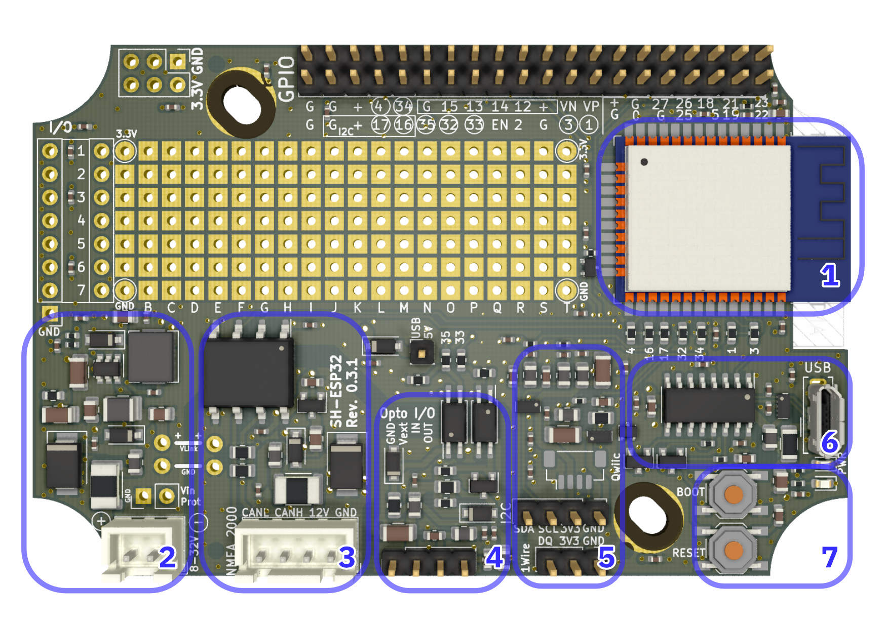
*Figure 8. Functional blocks of SH-ESP32.*

## Connectors

[Figure 9](#fig_connectors) illustrates the different connectors on the SH-ESP32.
The connectors are as follows:

1. **Power connector**:
   A JST XH compatible power connector.
   A 2.5 mm terminal block can be fitted on the same footprint.

2. **CAN bus connector**:
   A 4-pin JST XH connector designed to be connected to a standard NMEA 2000 compatible DeviceNet M12 connector on the enclosure.
   This connector can also be replaced with a 2.5 mm terminal block if so desired.

3. **Optocoupler I/O header**:
   Optocoupler input and output can be provided via this interface.

4. **1-Wire header**:
   1-Wire interface fitted with ESD protection and noise filtering as well as low-pass filtering required for longer networks.
   
5. **I2C header**:
   Four-pin header for connecting I2C slave devices to SH-ESP32.
   A female header accepts many popular inexpensive OLED display modules using the SSD1306 driver as is.

   There is also an unpopulated Qwiic-compatible JST SH footprint next to the 2.54 mm header.

6. **USB**:
   This is your standard USB Micro B connector.

7. **Protected Voltage**:
   These header pads can be used to output input voltage that has been reverse polarity and surge protected.
   Observe the polarity: it is opposite of the nearby power input connector.

8. **Voltage link**:
   If you intend to power the board using the NMEA 2000 interface and don't need galvanic connections to external systems, you can connect these pads together to route the power from the CAN bus connector to the main power supply.

9. **Proto board area**:
   This area can be used for your custom modifications.
   
10. **Additional voltage output**:
    Use these pads to get additional 3.3V voltage output for any modifications you need.

11. **GPIO header**:
    The GPIO header provides connections to all GPIO pins available on the ESP32 module.
    Some of the pins are used by other peripherals by default and need to be enabled
    using the solder jumpers.

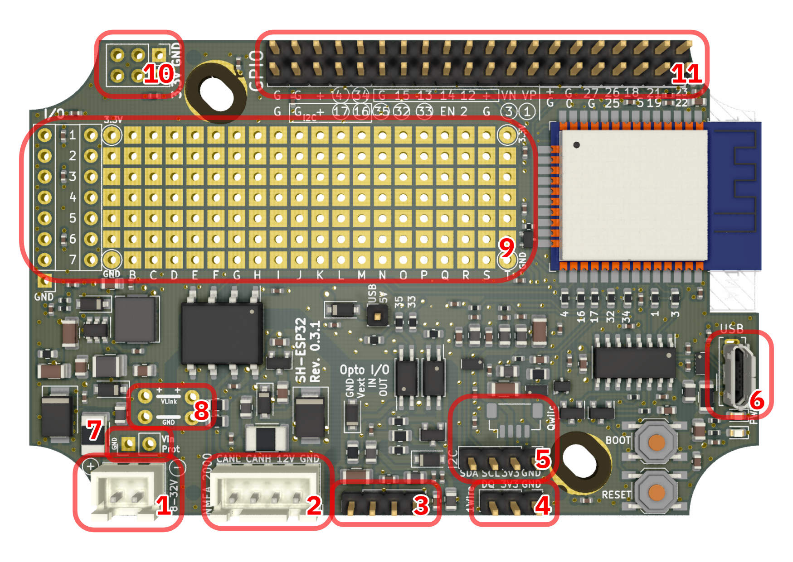
*Figure 9. SH-ESP32 connectors.*

## ESP32 module

ESP32 is a series of low-cost, low-power microcontrollers and microcontroller modules created and developed by Espressif Systems, a Shanghai-based Chinese company. 
The ESP32-WROOM-32 module is built around a powerful dual-core Tensilica Xtensa LX6 microprocessor and features integrated WiFi, dual-mode Bluetooth, and a remarkable amount of peripherals.

The SH-ESP32 features an ESP32-WROOM-32E module with an integrated PCB antenna, while the SH-ESP32-ufl uses ESP32-WROOM-32U that has an U.FL connector for an external antenna.

For more information, visit the [ESP32 Wikipedia article](https://en.wikipedia.org/wiki/ESP32), [Espressif's product pages](https://www.espressif.com/en/products/modules/esp32), or read the [module datasheet](https://www.espressif.com/sites/default/files/documentation/esp32-wroom-32_datasheet_en.pdf).

## Power supply

SH-ESP32 is designed to be used on a boat as easily as possible and includes an 8-32 V switching mode power supply with a maximum efficiency of nearly 90%. The power supply has a 3.3 V output with sufficient output current capability for powering both the ESP32 peak power consumption and any reasonable add-ons.

The power supply includes a self-resetting 500 mA polyfuse, reverse polarity protection, and a hefty TVS protection diode that has a breakdown voltage of 36.7-40.6V and maximum peak pulse dissipation capacity in excess of 600W.
Additionally, the power supply includes EMC filtering, designed to keep the conducted emissions of the switching-mode power supply below the regulatory limits.

The switcher IC is Silergy SY8401 that has a wide input range of 4.5-60 V and a maximum output current of 0.8 A.

## Peripherals

### Buttons and LEDs

There are two buttons and two LEDs on the SH-ESP32. The two buttons are labeled Reset and Boot. The Reset button resets the board by pulling the ESP32 Enable pin low.
The Boot button is connected to GPIO0 and can be used during device startup to force the module into a download mode. Otherwise it can be used as a regular button input.

The two LEDs are not explicitly labeled.
The red LED is lit whenever there is 3.3V power on the board.
The blue LED is connected to GPIO2 (the pin commonly used for LED on ESP32 development boards).
It can be controlled by user programs to indicate the state of the device.

### USB

The USB interface can be used to reprogram the ESP32 module and to communicate with the user application. It also powers the board when plugged in. The board can be safely powered using the main power connector and USB simultaneously -- rectifying diodes ensure that only the highest voltage supply is used.

The USB interface is implemented using a low-cost CH340C USB to serial interface chip.
It emulates a standard serial interface with bit rates of up to 2 Mbps.

CH340 chips are natively supported by Linux kernels but require a driver on Mac and Windows.
The driver can be downloaded from the [manufacturer website](http://www.wch-ic.com/downloads/CH341SER_ZIP.html).

### CAN bus (NMEA 2000)

NMEA 2000 is a ubiquitous communications standard used for connecting sensor, control, and display devices on boats and ships.
It is based on the Controller Area Network (CAN bus) which is a vehicle bus standard designed to allow devices to communicate with each other without a host computer.

SH-ESP32 includes an isolated CAN bus interface that allows safe and NMEA 2000 compliant interconnection of devices.
The CAN bus interface can be used to directly output sensor readings to the NMEA 2000 network, or to build NMEA 2000 gateways or similar devices.

The CAN interface uses ESP32's integrated CAN controller and the ISO1050DUB isolated CAN transceiver by Texas Instruments. It features support for high isolation voltages and transients, and bit rates of up to 1 Mbps.

The CAN bus interface can also be used to power the whole device if there are no galvanic connections to other external systems. (FIXME: Needs a more thorough description and illustration.)

The CAN interface includes a built-in termination resistor that can be enabled by closing the "CAN term" solder jumper on the bottom side of the board.

### I2C

I2C (Inter-Integrated Circuit) is a very popular synchronous serial communication bus commonly used for interfacing with a number of different ICs.
It uses two data wires in addition to voltage and ground.

I2C can be used to connect a large number of devices to the SH-ESP32.
Device types include analog-to-digital converters, attitude sensors, temperature and humidity sensors, displays, keypads, GPS, and so on.
Any Qwiic-compatible board from SparkFun can be used with the SH-ESP32 by splicing the wires or by adding a JST SH compatible connector to the available footprint.

Maximum I2C bus distances depend on the load, but should be less than 3-4 m. There are better suited protocols for long distance communication.

### 1-Wire

1-Wire is a device communications bus system designed by Dallas Semiconductor, since acquired by Maxim Integrated Products.
Although 1-Wire is a slow-speed protocol, supporting only speeds up to 16.3 kbps, it is very simple to implement and can be used over long distances. 
It is commonly used for temperature sensors and similar simple sensing devices.

The SH-ESP32 1-Wire implementation features ESD and RF noise filtering as well as low-pass filtering to improve network reliability.

### Optocoupler input and output

Optocoupler input and output is the recommended way to add simple digital signal input and output and sensing to different external systems.
It can be used e.g. to count alternator pulses for RPM measurement or switch relays on or off.

Additionally, the SH-ESP32 opto I/O implementation should be able to drive slow-speed single-side NMEA 0183 interfaces.

The absolute maximum voltage for the optocoupler input is 18V but it can be extended by adding an additional current-limiting resistor in series to the input.

For output purposes, operating voltage must be provided by the external circuitry.
It is possible to drive small automotive relays using the optocoupler output. In that case, the solenoid pins should be connected to the Vext and OUT pins.

### GPIO header

The GPIO header can be used to access all GPIO pins of the ESP32 module.
The silkscreen labeling next to the header, shown in [Figure 10](#fig_gpio), refers to the GPIO numbers of the pins.

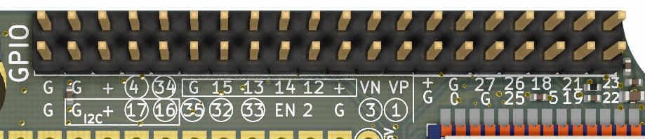
*Figure 10. SH-ESP32 GPIO header pinout.*

Circled numbers are by default used by other peripherals and have to be connected by setting the solder jumpers (see Section "[Customizing GPIO assignments](#solder_jumpers)" for more information).

The pin group including GPIOs 16 and 17 encapsulated by a rectangle can be used as duplicate I2C header if the respective solder jumpers are closed.

The pin group with GPIOs 12-15 can be used as a JTAG connector with some [simple external hardware and software](http://openocd.org/doc/html/Debug-Adapter-Hardware.html).
JTAG is an industry-standard debugging interface for microcontrollers and other programmable devices that allows on-chip debugging, including setting hardware breakpoints, stepping through code and inspecting live variable values.

Finally, the pin group consisting of the 14 pins on the right end of the header will be used by an Ethernet add-on board.

No ESD, RF noise protection or other filtering is provided for the GPIO header pins. 

### Proto board area

The large open area in the middle of the SH-ESP32, shown in [Figure 11](#fig_proto_area), is the proto board area.
It can be used to add new functionality via embedded 3rd party modules or THT circuitry.
Layer fills or traces on the inner copper layers are on purpose avoiding the proto board area, and the area can be safely drilled or modified to accept larger components, if needed.
There are traces very close to the area, however, so some care should be taken when modifying the pads at the border of the area.

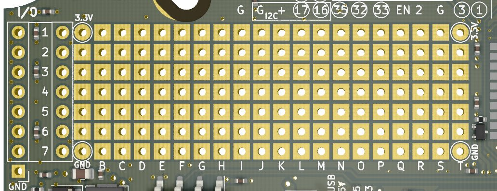
*Figure 11. SH-ESP32 proto board area.*

The round pins to the left hand side are horizontally connected and designed to make placing headers on the PCB edge easier.
You can place a header on the row at the edge and make connections to the inner row of round pads.

## Pinouts of peripherals

The ESP32 has a GPIO matrix that allows most of the digital GPIO functionality to be mapped freely to any GPIO. This is utilized extensively on SH-ESP32, and few peripherals are mapped to their standard pins. The GPIO pinout of different peripherals is given below. Unlisted pins are not used by SH-ESP32 and can be
utilized freely.

The GPIOs having a mark in the Jumper column are by default connected to the respective peripheral and disconnected from the GPIO header. These connections may be altered by modifying the jumpers as described in Section "[Customizing GPIO assignments](#solder_jumpers)".

| GPIO # | Jumper | Function | Optional Function |
| ------ | -------- |  |
| 00 |   | BOOT | Ethernet REF_CLK |
| 01 | x | Serial TXD0 |  |
| 02 |   | Blue LED |  |
| 03 | x | Serial RXD0 |  |
| 04 | x | 1-Wire data |  |
| 05 |   | Free | Ethernet Reset_N  |
| 12 |   | Free | JTAG TDI |
| 13 |   | Free | JTAG TCK |
| 14 |   | Free | JTAG TMS |
| 15 |   | Free | JTAG TDO |
| 16 | x | I2C SDA |  |
| 17 | x | I2C SCL |  |
| 18 |  | Free | Ethernet MDIO |
| 19 |  | Free | Ethernet TXD[0] |
| 21 |  | Free | Ethernet TX_EN |
| 22 |  | Free | Ethernet TXD[1] |
| 25 |  | Free | Ethernet RXD[0] |
| 26 |  | Free | Ethernet RXD[1] |
| 27 |  | Free | Ethernet CRS_DV |
| 32 | x | CAN TX |  |
| 33 | x | Opto OUT |  |
| 34 | x | CAN RX |  |
| 35 | x | Opto IN |  |

### Customizing GPIO assignments

Nearly all hard-wired peripherals can be disconnected by unsoldering a 0R resistor jumper on the board top layer.
In a similar fashion, the solder jumpers on the bottom layer can be closed to connect the GPIO pin to the respective GPIO header pin.
The resistor and solder jumpers are illustrated on Figures [12](#fig_top_jumpers) and [13](#fig_bottom_jumpers).

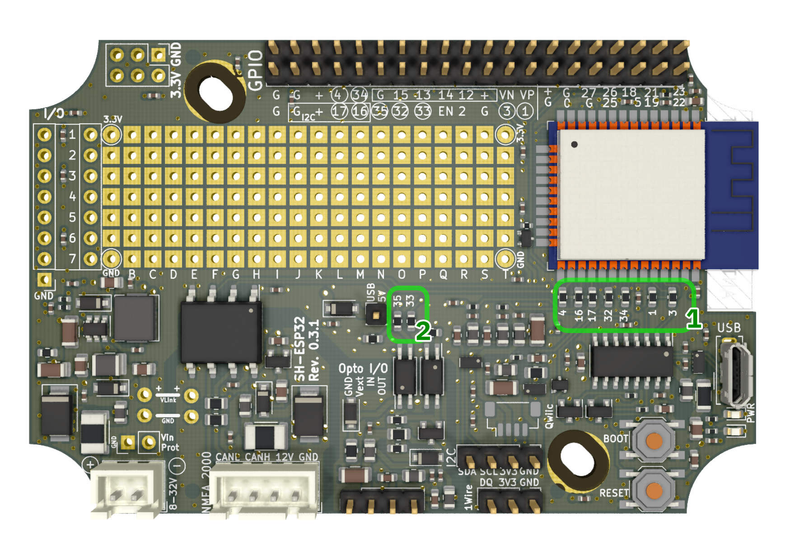
*Figure 12. Resistor jumpers on the top layer. To disconnect the GPIO pin from any peripheral, unsolder the respective jumper.*

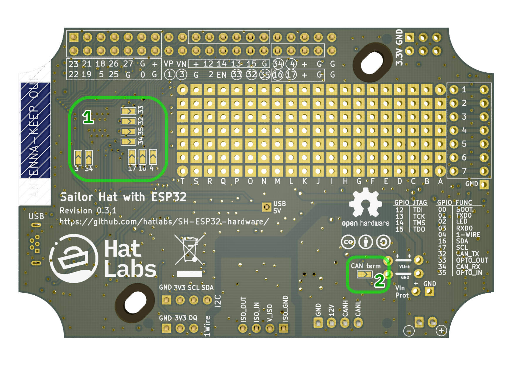
*Figure 13. Solder jumpers on the bottom layer. To connect a GPIO pin to the GPIO header, close the solder jumper by adding a blob of solder on top of the jumper area.*

For example, if don't need the CAN interface and want to reuse the GPIOs 32 and 34 on the GPIO header, desolder the resistors labeled 32 and 34 next to the ESP32 module to disconnect the module from the CAN interface.
Then close the solder jumpers labeled 32 and 34 to connect the GPIO pins to the GPIO header.

Likewise, if you want to enable I2C both on the GPIO header and the dedicated I2C connector, close the solder jumpers 16 and 17 on the board bottom layer.

Finally, the jumpers on either side can be used to customize the GPIO assignments. For example, if you want to swap 1-Wire data pin from GPIO4 to GPIO15, you can unsolder the GPIO4 resistor jumper and add a jumper wire from either the ESP32 module pad or the GPIO header to the lower resistor jumper pad.

# Software

There are a lot of options for languages and environments for writing software for SH-ESP32. If you don't know where to start, using Visual Studio Code and PlatformIO and SensESP are the recommended choices, but depending on your needs and preferences, you might want to try other options as well.

## SDKs

There are multiple Software Development Kits (SDKs) available for the ESP32 environment. All of these are compatible with the SH-ESP32.

[Espressif SDK](https://www.espressif.com/en/products/software/esp-sdk/overview) is the official C++ programming environment.
It has a C style API that does not rely on classes or objects.
It also exposes FreeRTOS, the underlying Real-time Operating System directly.
As the official development environment, Espressif SDK provides the most complete access to ESP32 functionality.

Espressif SDK uses CMake as its build system.

[Arduino Core for ESP32](https://github.com/espressif/arduino-esp32) is an Arduino SDK for the ESP32.
It is also maintained by Espressif and, thanks to the breadth of the Arduino ecosystem and related documentation, is probably the most widely used SDK for ESP32.

The Arduino Core can be used either with [Arduino IDE](https://www.arduino.cc/en/software),  or [PlatformIO](https://platformio.org/).

Arduino IDE is a beginner-friendly software development environment originally developed for the Arduino brand hobbyist developer boards.
It is very easy to start with but the editor is ill-suited for more serious software development, and it also has inherent limits in library and environment management.
Also, it uses its own build system and project layout which is incompatible with other systems.
It is a good choice for very simple single-purpose sketches, but for more complex projects or integrating with e.g. Signal K or other server protocol, look further.

PlatformIO is a cross-platform development environment for different microcontrollers.
It can be used purely on the command line but also integrates well into Visual Studio Code, which is an excellent multi-language code editor and development environment. PlatformIO performs library management and dependency resolution and also includes support for hardware debuggers and more.

If you want to develop the SH-ESP32 using higher-level languages, [MicroPython](https://micropython.org/) is a good choice.
It provides high compatibility with normal Python while running on the FreeRTOS. There are ready-made modules for many ESP32 subsystems and peripherals.

[NodeMCU](https://nodemcu.readthedocs.io/en/dev-esp32/) is a yet another SDK available for the ESP32. NodeMCU is based on lua, which is a lightweight programming language designed primarily for embedded use in applications. NodeMCU was previously popular in ESP8266 development but has since become eclipsed by the more popular programming environments.

[Rust](https://github.com/MabezDev/rust-xtensa) is yet another programming language choice for the Espressif microcontrollers.
Rust is a modern language that has excellent features for systems programming but the ESP32 support is still under heavy development and the documentation is lacking.

## Application frameworks

When you start developing your C or C++ application for integrating onto Signal K or NMEA 2000, it usually pays off to use some existing library or framework as a stepping stone.
As of now (March 2021), the two prime candidates are [SensESP](https://github.com/SignalK/SensESP) and [ESPHome](https://esphome.io). 
SensESP, described in the subsection below, is a set of libraries designed to easily integrate sensor devices into the Signal K system but has a lot of features for general purpose embedded development as well. 
ESPHome is a system designed to control ESP devices using simple configuration files and has good integration to multiple home automation platforms.

### SensESP

[SensESP](https://github.com/SignalK/SensESP) is a sensor development platform for ESP8266 and ESP32 that can be used as a high-level toolkit for creating hardware devices interfacing with Signal K servers. 
It can be easily integrated with NMEA 2000 networks and has a lot of helpful features for asynchronous embedded programming, such as extensive use of the consumer-producer pattern and high level concepts of Sensors, Translations and Consumers (Outputs).

# Add-on boards

There are several add-on boards available or being developed for the SH-ESP32.

Proto Board Top HAT is a add-on board the size of SH-ESP32 that plugs onto it and provides ample area for user customizations. 
It is available for purchase at the [Hat Labs store](https://hatlabs.fi/product/sh-esp32-protoboard-tophat/). 
The design files are available at the [SH-ESP32 hardware repository](https://github.com/hatlabs/SH-ESP32-hardware/tree/main/SH-ESP-HAT-Proto).

Several other hats such as a digital switching [PowerFET HAT](https://github.com/markfarnan/yacht_hardware/tree/main/SH-ESP32-PowerFET) or an [Ethernet HAT](https://github.com/markfarnan/SH-ESP32-Ethernet) are under development.

If you want to develop your own SH-ESP32 hat, a [blank hat template](https://github.com/hatlabs/SH-ESP32-hardware/tree/main/SH-ESP-HAT-Blank) is available at the SH-ESP32 repository.

# Acknowledgments

Matti Airas, the Mad Hatter and founder of Hat Labs Ltd, initiated the project and has done most of the initial hardware development and testing. Mark Farnan has done major contributions and hardware design improvements, including all add-on board designs. Karl-Erik Gustafsson has provided a lot of invaluable guidance, especially regarding electromagnetic compatibility design.
