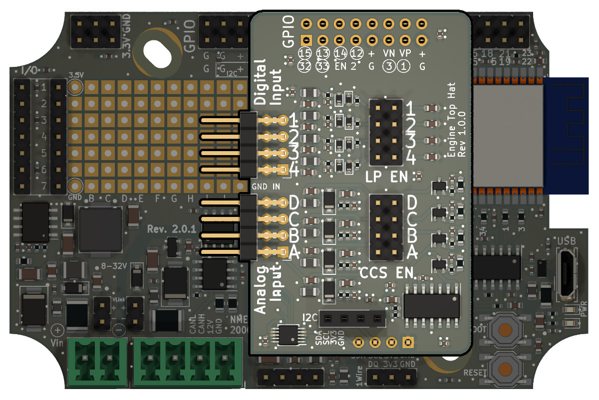
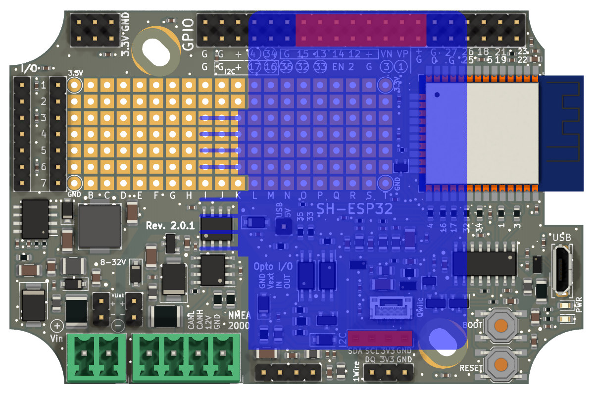
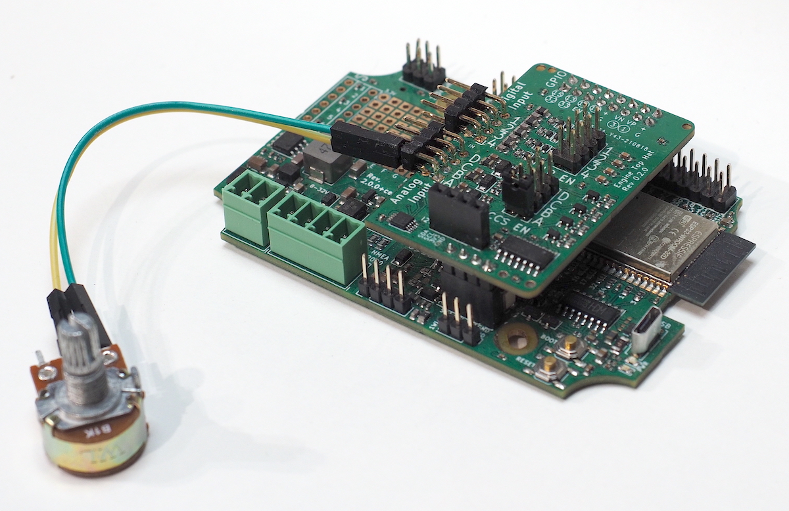
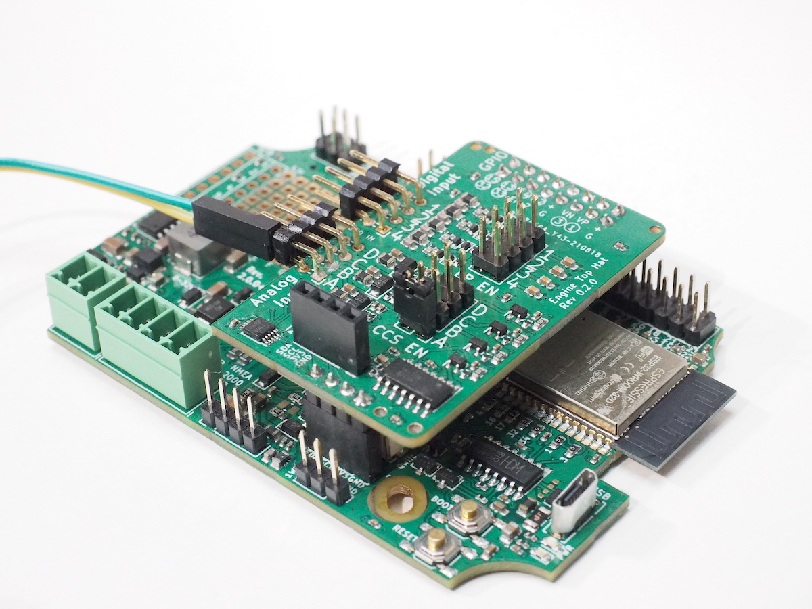
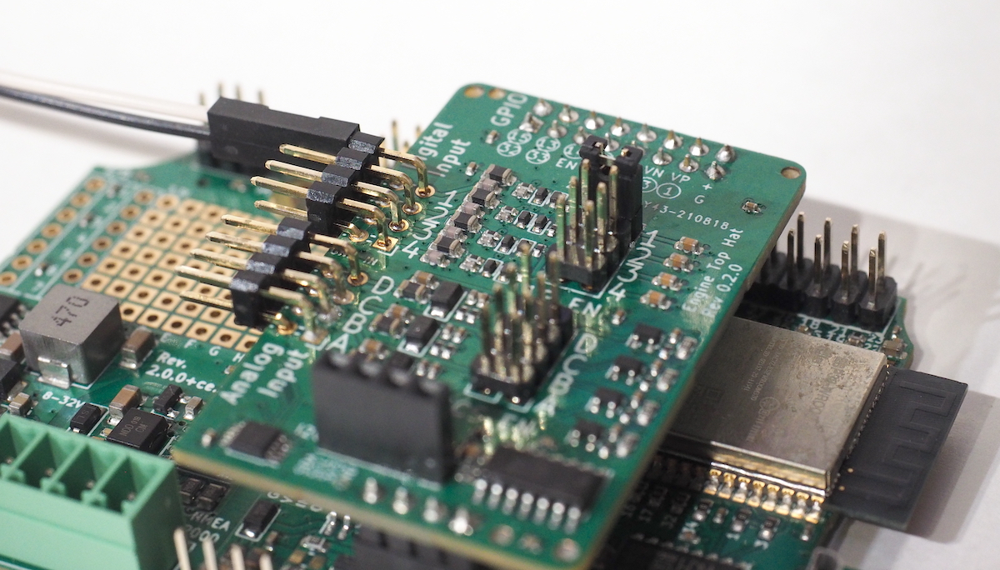

# Getting Started with the SH-ESP32 Engine Top Hat

## Hardware Installation

The Engine Hat is intended to be used with the SH-ESP32.
To install the Engine Hat, align it with the I2C and GPIO connectors on the SH-ESP32 and press down until the header pins have fully mated.
See the pictures below for the exact alignment.

{:width="50%"}

Outline of the engine hat in blue, with the mating connectors highlighted in red:

{:width="50%"}

## Connecting Tank Senders and Other Resistive Sensors

The analog and digital inputs are on the stacked horizontal headers of the board.
The inputs are on the top row while the bottom row is connected to ground.

Resistive sensors are transducers or electromechanical devices that convert a mechanical, temperature, pressure, or other signal to electrical resistance.
As such, they are passive devices and do not generate electricity.
In short, resistive sensors can be thought of as fancy potentiometers, or adjustable resistors.

The Engine Hat implements a constant current source to measure resistance values.
A 10 mA current is sent through an analog input pin, and the voltage between the pin and ground is measured.
Resistance values from close to 0 ohm to about 300 ohm can be measured.
This range covers both typical European (0-180 ohms) and American (240-33 ohms) tank senders as well as common oil pressure sensors.

To connect the sender, attach the sender measurement pin to the top pin of an analog input channel.
The sender ground pin is connected to the bottom pin.

The photo below illustrates connecting a potentiometer to the Engine Hat.

{:width="50%"}

By default, the analog inputs are configured as passive voltage sensors.
The constant current source on the analog inputs must be separately enabled by connecting a jumper over the respective row of the CCS header, as shown in the photo below:

{:width="50%"}

### Connecting Tank Senders with Existing Gauges

If you want to keep an existing fuel tank gauge connected, you can safely connect the Engine Hat in parallel to it.
However, in this case the original gauge will provide the measurement current, and you **must not** enable the constant current source.
In this case the engine hat will perform a simple voltage measurement.

## Measuring Voltages

The Engine Hat analog inputs can be used for passive voltage measurements as well.
The measurement range is 0-29V.

Connect the measurement voltage in a similar manner as a tank sender described above, but leave the constant current source disabled.
Pay attention to polarity!
Reverse polarity may cause damage to the device.

## Connecting Alarms and Other Binary Outputs

Digital inputs can be used for detecting engine alarms and other similar signals.
Connect them to the Digital Input header, with the hot lead going to the top row and ground to the bottom.
The inputs support a voltage range of 0-30V, with a fixed threshold voltage of 1.65V for the logic level change.
Negative voltages are allowed.

## Connecting Tachometers (RPM senders)

The digital inputs can be used to measure tachometer RPMs or other repetitive pulse measurements such as fuel flow meters.
Connect them like alarms, with the hot lead going to the top row and ground to the bottom.
Both alternator W terminals and inductive tachometer senders such as the ones used on Yanmar engines can be directly connected.

Some tachometer senders such as the alternator W terminals are notoriously noisy, resulting in unreliable measurements.
In such cases, the reported RPM value usually is much higher than the actual RPM.
The Engine Hat includes an optional low-pass filter with a 2.3 kHz cutoff frequency to help filter out such noise.
To enable the low-pass filter for a digital input channel, connect a jumper over the respective row of the LP EN header:

{:width="50%"}

Note that the hardware filter only will get you so far.
For particularly noisy input signals, implementing additional software filtering may be required for reliable results.

## Software

See the [SH-ESP32-engine-hat-firmware](https://github.com/hatlabs/SH-ESP32-engine-hat-firmware) GitHub repository for example firmware.
