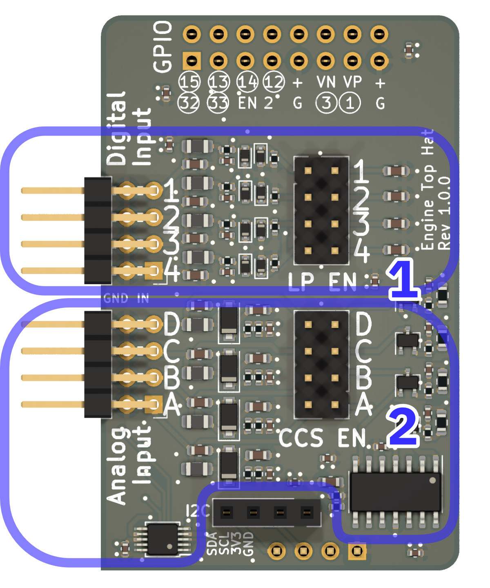
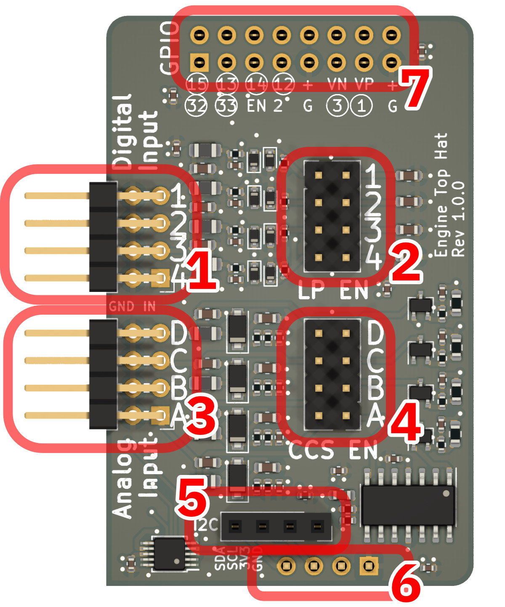

# SH-ESP32 Engine Top Hat Hardware

## Analog Inputs

The Engine Hat includes four analog input channels, implemented using Texas Instruments' AD1115 analog to digital converter.
The analog inputs can be individually configured as passive voltage sensors or active resistance sensors.
As voltage sensors the input channels sense a 0-29V voltage range with a 16-bit resolution.
As resistance sensors, they implement a 10 mA constant-current source to read sensor resistances between 0-300 ohm.

## Digital Inputs

Engine Hat has four wide voltage range digital inputs.
The inputs support an input voltage range of 0-30V.
The threshold voltage is fixed at approximately 1.65V.

The digital inputs can be used either as digital value inputs for detecting engine alarms or other similar signals, or as counters for measuring tachometer signals or other repetitive pulses.

Each digital input channel has an optional, jumper-enabled low-pass filter with a 2.3 kHz cutoff frequency.
The low-pass filter can be used to filter noisy tach signals, in particular, the alternator W terminal signals.

## Tour Around the Board

The illustration below shows the two main functional blocks of the Engine Hat.

{:width="50%"}

Block 1 provides the digital input functionality for alarm inputs and frequency counting.

Block 2 provides the four analog input channels, their input protection, and the optional constant-current source.

## Connectors

The Engine Hat connectors are shown below.

{:width="50%"}

1. Stacked horizontal header for the four digital inputs.
   The top row is for the digital input signal pins, the bottom row is for the ground connections.
2. Jumper header for enabling the low-pass filter for each input channel.
3. Stacked horizontal header for the four analog input channels.
   The top row is for the analog input signal pins, the bottom row is for the ground connections.
4. Jumper header for enabling the constant-current source for each analog input channel.
5. I2C pass-through female header for connecting a display module or other I2C devices.
6. I2C male header for connecting to the main board (on the bottom side of the PCB).
7. GPIO female header for connecting the digital inputs to the main board (on the bottom side).

## Pinout

The sections below documents how the inputs are mapped to the ESP32 GPIO pins.

### Digital inputs

| Input # | ESP32 GPIO |
| ------: | ---------: |
| 1       | 15         |
| 2       | 13         |
| 3       | 14         |
| 4       | 12         |

### Analog inputs

Analog inputs are read using the ADS1115 analog-to-digital converter.

The raw input signal is scaled using a voltage divider down to voltage levels accepted by the ADC. The scaling factor is 2.048/29.

The ADS1115 uses the I2C bus for communicating with the ESP32.
The default I2C address is 0x4b, but that can be changed using the solder jumper pads on the bottom side of the PCB.

Note that the SH-ESP32 uses GPIO 16 for the I2C SDA line and GPIO 17 for the I2C SCL line. These values are different from the Arduino ESP32 framework defaults, and any generic example code should be adjusted accordingly.

## Design Files and Schematics

SH-ESP32 Engine Top Hap design files can be found at the [project GitHub repository](https://github.com/hatlabs/SH-ESP32-engine-hat).

Schematics for different hardware revisions can be found here:

- [SH-ESP32 Engine Top Hat v1.0.0](assets/Engine_Hat_Schematics_v1.0.0.pdf)
