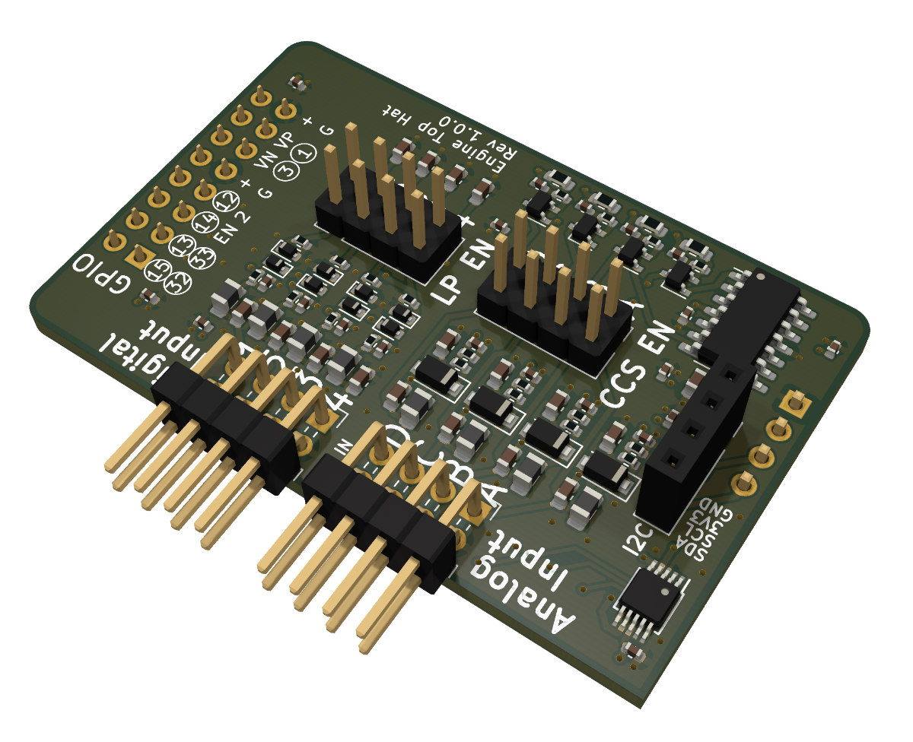

# SH-ESP32 Engine Top Hat

SH-ESP32 Engine Top Hat (Engine Hat) is an add-on board for the SH-ESP32.
It allows you to measure common engine outputs:

- Tachometer (RPM) senders, either using dedicated tach senders or alternator W terminals
- Digital inputs such as engine alarms
- Tank senders
- Other resistive senders such as oil pressure senders with a resistance range of 0-300 ohm

The Engine Hat is a developer device.
While example software is provided online, using the Engine Hat requires basic familiarity with working with sensors and microcontrollers.

See the [Getting Started](getting-started/) page for hardware installation and connection instructions.

The [Hardware](hardware/) page contains more detailed information about the Engine Hat hardware.

The SH-ESP32 Engine Top Hat is open hardware and the design files can be found at the [project GitHub repository](https://github.com/hatlabs/SH-ESP32-engine-hat). The product is available for purchase at [hatlabs.fi](https://hatlabs.fi/product/sh-esp32-engine-top-hat-kit/).

## Specifications

- Compatible with SH-ESP32 (all versions)
- 4 digital input channels (1-4)
  - input voltage range: -30V to +30V
  - threshold voltage: 1.65V
  - optional 1st order low-pass filter with cutoff frequency of 2.3 kHz
- 4 analog input channels (A-D)
  - input voltage range: 0-29V
  - analog-to-digital converter: AD1115
  - ADC resolution: 16-bit
  - optional constant-current source with 10 mA current
  - resistance measurement range: 0-300 ohm
