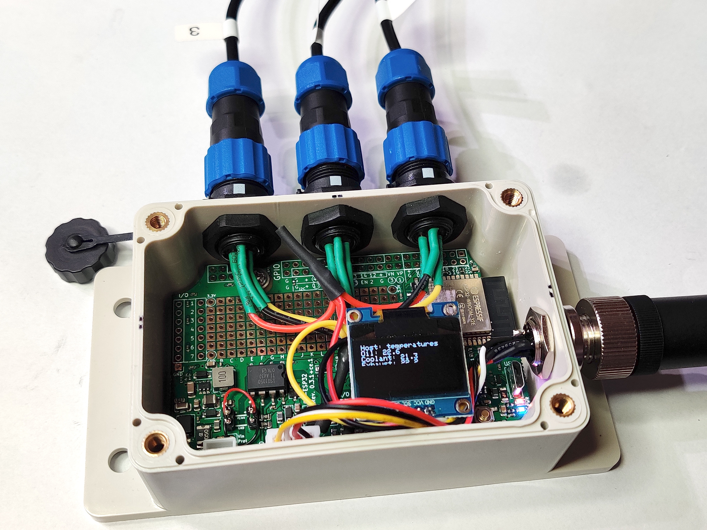

# Media assets

Here you can find some high-resolution photos and other pictures suited for publication use.

## Renderings

SH-ESP32 rendering, top:

SH-ESP32 rendering, bottom:

SH-ESP32 rendering, top, non-orthogonal:

SH-ESP32-ufl (external Wi-Fi antenna version) rendering, top, non-orthogonal:

## Photos

SH-ESP32 board with pluggable terminal blocks:

SH-ESP32 in an enclosure:

SH-ESP32 in an enclosure with the power plug:

SH-ESP32-ufl in enclosure:

SH-ESP32 with 1-Wire temperature sensors:

SH-ESP32 NMEA 2000 gateway finished assembly:
