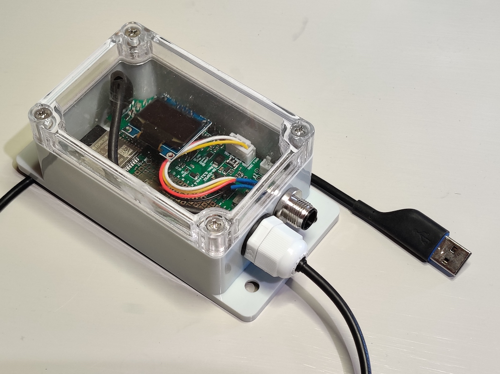
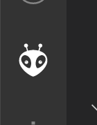
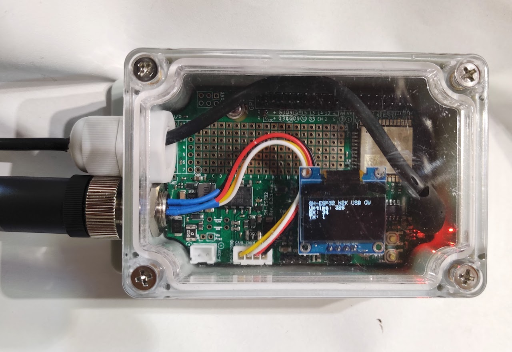

# NMEA 2000 USB gateway
{: .no_toc }

## Table of contents
{: .no_toc .text-delta }

1. TOC
{:toc}

---

## Introduction

In this tutorial, I'll show how to build an Actisense NGT-1 compatible NMEA 2000 USB gateway with an SH-ESP32 and a couple of connectors.
Thanks to the SH-ESP32's integrated CAN interface, no external hardware is required.
The resulting device is an isolated NMEA 2000 gateway that will both read and write NMEA 2000 packets and allow your computer to interface with your boat electronics.
The NMEA 2000 gateway could be used to interface any major PC based navigational software with your NMEA 2000 network, or to connect a Raspberry Pi based Signal K server to the NMEA 2000 bus, or even to diagnose NMEA 2000 issues with suitable software.

If you have any suggestions, corrections, improvement ideas, or other feedback about this tutorial, I'd love to hear about them at [matti.airas@hatlabs.fi](mailto:matti.airas@hatlabs.fi).

## Parts needed

To complete this tutorial, you need the following parts:

- [SH-ESP32 enclosure bundle](https://hatlabs.fi/product/sh-esp32-enclosure-bundle/)
- [NMEA 2000 male panel connector](https://hatlabs.fi/product/nmea-2000-panel-connector-male/)
- USB panel connector (soon to be available at hatlabs.fi) or a [PG9 cable gland](https://hatlabs.fi/product/pg9-cable-gland/)
- [OLED display](https://hatlabs.fi/product/128x64-oled-display/) (optional)

## Hardware assembly

### Required accessories

We'll use the standard waterproof SH-ESP32 enclosure for this project.

{:width="50%"}

We need to connect the device to both NMEA 2000 and USB.
For NMEA 2000, a standard M12 micro connector is used.

{:width="50%"}

For the USB connector, the preferred option is to use a ready-made micro USB panel connector:

{:width="50%"}

Another option would be to use a cable gland to route a micro USB cable to the enclosure.
That's the option I chose, mainly because I hadn't yet received the panel connector shipment I was waiting for.
Using a cable gland with a ready-made cable is a fiddly process, though. 
I had to drill out the internal collar on the cable gland and enlarge the hole on the gland cap nut.
To make the big PG9 cable gland grip on the thin USB cable, I wrapped a few rounds of PVC tape over the cable.
The end result is a bit hacky but good enough for government work!

### Drilling holes

You need to decide where to place the connectors on the enclosure.
I prefer having the connectors both on the same short edge.
That allows the enclosure to be mounted on a wall connectors facing down.
Such an orientation minimizes the risk for water leaking through the connector
seal.

Connector placement is a tight fit.
When marking the center points, take into account both the enclosure inner corners and the needed spacing to allow the connector nuts to rotate.
A sample result is shown in the photo below.

{:width="50%"}

### Connecting wires to the NMEA 2000 panel connector

The NMEA 2000 connector requires the wires to be soldered to it.
I am using the provided JST XH connectors and pigtails.
The pigtail follows the NMEA 2000 standard color scheme, except that the L signal wire is yellow instead of the standard blue.

The connector pins have small cups, as shown in the photo below:

{:width="50%"}

Heat the pins one at a time with the solder iron and apply some solder to the cups.

Before attaching the wires, cut small lengths of heat shrink tube and slide it over the wires.
You want to have the heat shrink tube because it will add some mechanical support on the wires in addition to preventing accidental shorts.

Pay close attention to the correct pin ordering. The correct pinout, _when observing from the side you're soldering the wires on_, is shown in the figure below.
(The figure says "female connector" but that's when you're staring at the front side of the connector.)

> I repeat, pay close attention to the correct pin ordering.
> When preparing this tutorial, I first applied all the pins mirrored (following a male connector pinout diagram).
> It wouldn't work, of course.
> At the next attempt, I had the H and L pins swapped. Still wouldn't work.
> Third attempt, I had the pins in the correct order but I had forgot to replace the heat shrink tube.
> On the fourth attempt, I got it right.
> Be unlike me!
> Focus when you're soldering the connectors!

{:width="50%"}

To solder the wires to the pins, take the pigtail, and one pin at a time, heat the pin so that the solder melts and insert the wire end to the solder-filled cup.
Start with the center pin first because it's easier to put on before the other wires are in the way.

Once all wires are attached, let the connections cool a bit and then slide the heat shrink tubes over the pins.
To heat the tubes, a hot air soldering workstation or a hot air gun are ideal, but even a lighter flame will do.
If you're using a flame, be just sure not to overdo it. You don't want charring on the heat shrink tubes.

An example end result is shown in the following figure.

{:width="50%"}

The photo also shows one trick of mine: for soldering many types of connectors, sturdy pliers and some rubber band keep the connector perfectly still when soldering.
I find that easier than using the cheap helping hands I have.

### Assembly

Finally, screw the NMEA 2000 panel connector in place.
Tightening it properly can be bothersome, but no matter what you do, do not apply locktite to the connector.
If any locktite gets on the ABS plastic, it'll turn all brittle and disintegrate from the slightest breeze!
Trust me!
Instead, a drop of superglue might work once you've verified that everything works.
Or maybe a tiny drop of acetone between the enclosure plastic and the connector body.
Acetone softens ABS and turns it into a sticky glue-like substance.

Also put on the cable gland and the USB cable (or the USB panel connector).
A cable with a straight connector is a bit of a tight fit but I doubt an angled connector would have fit through the cable gland.
Despite measuring twice, I still had drilled the holes too close to each other, and the nut wouldn't rotate freely.
Instead, I was able to twist the gland body to tighten it up. It's not perfect but will work fine.

If you want to use an OLED display, plug it in now.

The end result is shown in the photo below.

{:width="50%"}

## Software

### Prerequisites

To install the software on the device, you need to first [install Visual Studio Code and PlatformIO](https://platformio.org/install/ide?install=vscode).

Another prerequisite is the driver for the CH340 USB serial chip. Linux supports it out of the box but Windows and Mac users need to download and install the driver from [the manufacturer website](http://www.wch.cn/download/CH341SER_EXE.html). The driver is used both for installing the software and using it.

### Installation

The SH-ESP32 NMEA 2000 USB gateway software is available here: [https://github.com/hatlabs/SH-ESP32-nmea2000-gateway](https://github.com/hatlabs/SH-ESP32-nmea2000-gateway)

Once you have PlatformIO installed, clone the repo (if you're comfortable with Git) or download the source code as a zip file by clicking on the green "Code" button and selecting "Download ZIP".
Unzip the package and open the directory in Visual Studio Code (File -> Open Workspace). 
Connect the USB cable to your computer.
Then, click on the PlatformIO bug icon (shown below) on the left border toolbar.
Select Default -> Upload.
You should see the build system and compiler output scroll at the bottom part of the screen as PlatformIO downloads the dependencies and builds everything.
Once everything is built, PlatformIO should proceed with uploading the software on your SH-ESP32.

If you want to personalize your device, open the `src/main.cpp` file in VSCode and edit the device information strings around line 74.
Those strings will be seen by other NMEA 2000 devices on the network.

If everything went fine, the blue led should start blinking slowly.
If you have a display, you should also see some status information there.

### Testing

If you plug the device to your NMEA 2000 network and your computer, you should immediately see the RX row on the display change.
That indicates how many NMEA 2000 messages have been received every second.
The TX row tells how many messages have been sent, but if you aren't running any software yet, it'll be zero.

I chose to test the device with Signal K Server.
You can install Signal K Server on a Raspberry Pi but for this purpose I installed it on my Mac laptop.
Linux and Windows should work too.
Basic installation instructions are available at the server GitHub repository: https://github.com/SignalK/signalk-server

I'm assuming you have managed to install and run the server and have browsed to the web UI now.
Right?

To enable the device, you need to add an NMEA 2000 data connection.
Select Server -> Data Connections.
Click on the blue Add button.

You should now see the following form.

Select "NMEA 2000" as the data type.
Provider ID can be any string.
`can0` is fine.
NMEA 2000 Source should be "Actisense NGT-1 (canboatjs)".
Click on the serial port selection (by default "Enter manually").
If your device was detected, you should see a device name there.
The device names are pretty uninformative.
On my Mac, the device shows itself as `/dev/tty.usbserial-14130` or similar.
On a Linux, it should be something roughly similar.
On Windows, the format is `COMn:`.
Select the device.
Everything else can be left as is.
Click Apply to save the changes.

Next, restart the server by clicking the Restart link at the top bar.
If you had started the Signal K server manually, you might now have to restart it on the command line.

If all went fine, you should have `can0` displayed in the "Connection & Plugin Status" section.

If your connection status is green, open the Data Browser and marvel at the received NMEA 2000 data!

Almost there.
You still want to test that transmitting data works too.
To get the Signal K server to transmit NMEA 2000 data, you need to install the `signalk-to-nmea2000` plugin.
Select Appstore -> Available and then change the type dropdown value from New/Updated to All.
Type `nmea2000` to the search box.
You should see the correct plugin as the only entry.
Install it by clicking on the small cloud download icon at the right end of the row.
Restart the server again.

Finally, configure the plugin: Server -> Plugin Config.
Open the "Signal K to NMEA 2000" section.
The default server installation doesn't have much data to transmit, but there's something: system time!
Scroll down to "System Time (126992)" and Enable it.

{:width="50%"}

Set the Resend time to 1 second.
Scroll down to the bottom of the page and select Submit.

If all the above steps went fine, you should see the TX row on the display change from 0 to 1:

If you have a Multi-function Display (chart plotter) on your NMEA 2000 network, browse to its Network settings.
On a device list page, you should now see "SH-ESP32 NMEA 2000 USB GW" among other devices!
If you tap on it, you should also see the time and date as provided data.
This means your installation was successful and you have data flowing back and forth!
Time to go brag about it online and to your marina neighbors!

