# 1-Wire temperature sensing

This tutorial will walk you through creating a temperature sensing device that can be used for example to measure engine oil, coolant, and wet exhaust temperatures of of any engine that doesn't already report these temperatures to Signal K or your N2K network.
My own engine is a Yanmar 3GM30F but the approach is completely generic and can be adapted to any engine.
I have had a similar setup for several years and it gives me an extra peace of mind: 
I would get an early alarm if the temperature would begin to rise (I've had coolant issues in the past), and also if I ever would forget to open the water intake seacock, I would get an alarm of rising exhaust temperature before anything irreversible could happen.

One SH-ESP32 can support as many temperature sensors as can be practically connected to it.

The end result of this tutorial is this neat little device that measures three different temperatures and is able to output them both wirelessly using the Signal K protocol and over NMEA 2000.

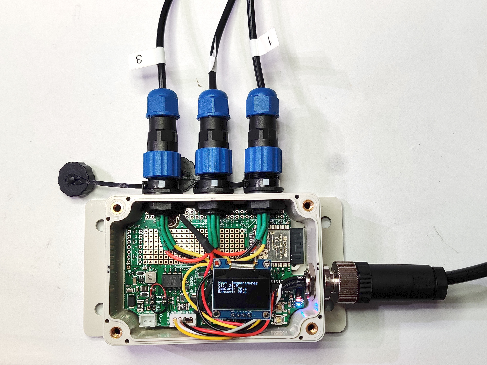{:width="50%"}

If you have any suggestions, corrections, improvement ideas, or other feedback about this tutorial, I'd love to hear about them at [matti.airas@hatlabs.fi](mailto:matti.airas@hatlabs.fi).

## Parts needed

To complete this tutorial, you need the following parts:

* [SH-ESP32 enclosure bundle](https://hatlabs.fi/product/sh-esp32-enclosure-bundle/)
* [1-Wire temperature sensor](https://hatlabs.fi/product/ds18b20-cable-3m/) -- as many as you need
* [SP13 connectors, 3-pin, male plug](https://hatlabs.fi/product/sp13-connector-3-pin-male-plug/) -- as many as you want external sensors
* [NMEA 2000 male panel connector](https://hatlabs.fi/product/nmea-2000-panel-connector-male/) -- if you want to connect the device to an NMEA 2000 network; otherwise it's Signal K only
* [OLED display](https://hatlabs.fi/product/128x64-oled-display/) (optional)

## Hardware assembly

I have previously had a similar setup where I spliced individual sensors together outside of the enclosure and routed them into the enclosure through a cable gland.
This approach works fine but is cumbersome for maintenance.
Removing the SH-ESP32 for modifications or debugging is difficult because the connections are permanent.

In this tutorial, I'll instead use separate connectors to allow for a more flexible installation.

### Preparing the enclosure

The enclosure needs to have holes drilled for the different connectors.
Due to the number of holes required, I prepared a [printable drill template](media/enclosure_with_template.pdf) that can be taped on the enclosure.

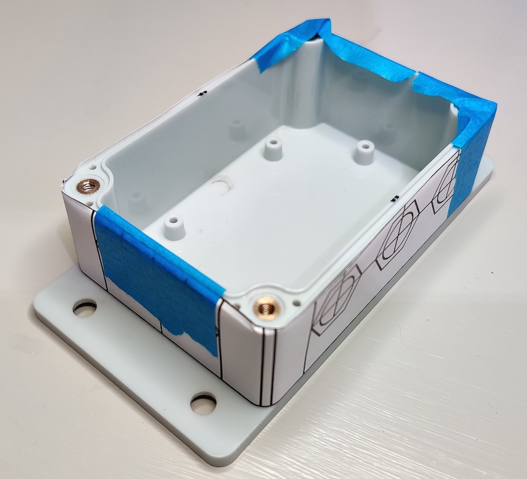{:width="50%"}

When printing the template, pay attention that it isn't scaled. 
The template paper size is the international standard A4, so especially North Americans should be careful not to accidentally scale the print when printing on Letter size paper.

To apply the template, first cut it out along the edges. 
Then mark midpoints of the enclosure sides with a felt pen. 
Align one side of the template with the midpoint mark and tape the end to the enclosure. 
Then pull the paper taut over the enclosure and ensure that the other midpoint marks are correctly aligned. 
Fix the template with a generous helping of tape. 
It doesn't matter if you tape over the template: at least masking tape is sufficiently translucent to show through the tape.

Once you have the template in place, decide where you want the connectors. 
If you don't have the GPIO header in place, the north edge of the SH-ESP32 has a plenty of room for connectors. The west edge is pretty vacant as well. The east side can easily fit connectors but one in the southeast corner will block the USB.

I wanted to mount my device vertically so that the power connector exits down and the temperature sensor connectors to the right. I just made the mistake of blocking the USB connector. I guess it's [over-the-air updates](https://docs.platformio.org/en/latest/platforms/espressif32.html#over-the-air-ota-update) for me, then...

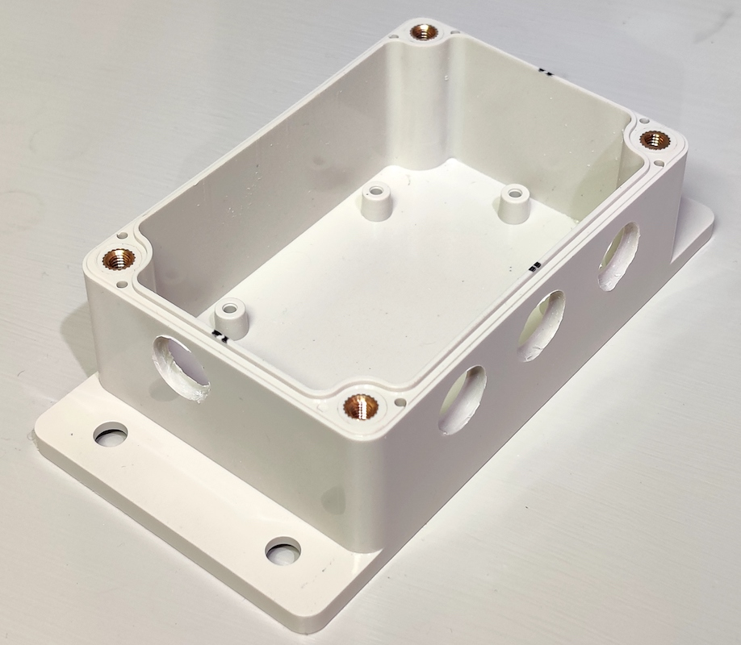{:width="50%"}

### Connecting wires

Connecting multiple one-wire sensors to one device is easy: you just need to connect each wire in parallel[^1].
I soldered lengths of wires on the connectors with the following pinout:

1. Ground (black)
2. 3.3V (red)
3. Data (yellow)

Next, I stripped 12 mm (1/2") of the wire and twisted each color tails (with an extra header wire) together and applied some solder to make a simple [rat-tail splice](https://en.wikipedia.org/wiki/Rat-tail_splice).

In the photo, the splices are without heat shrink tube but you should definitely add some to protect everything from shorting out.

**DON'T DO THIS:**

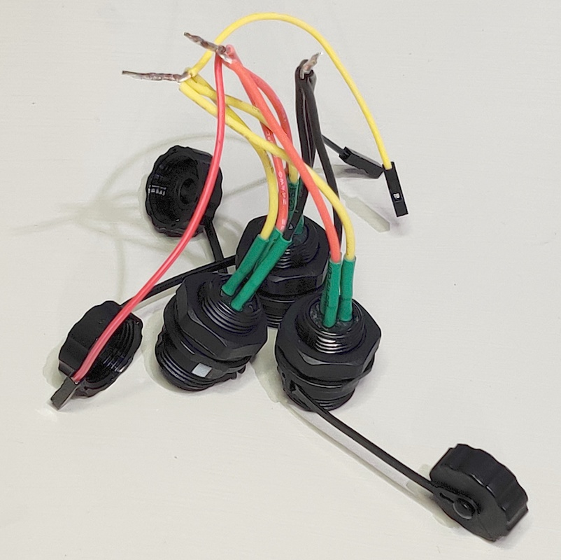{:width="50%"}

Quick, what went wrong in my attempt? 
Well, first, how do you get the connector nuts off? 
Second, how do you mount the connectors with the wires spliced together? 
Third, if you managed to mount the connectors, how would you get the nut back on?

Don't be like me. 
Instead, mount the connectors first, then splice the wires and apply some heat shrink tube.

If you want to connect the apparatus to NMEA 2000, add an M12 panel connector as described in the [NMEA 2000 USB gateway tutorial](../nmea2000-gateway/).
Alternatively, if you live in the future and are building a Signal K only setup, use the SP13 power connector provided in the enclosure bundle.
In that case, for consistency, make ground the first pin and 12/24V the second pin.

For NMEA 2000 use, you must also provide power to the SH-ESP32 device. You could do that by splicing the power wires and connecting them to the power pins, or by connecting the wire link shown in the photo below:

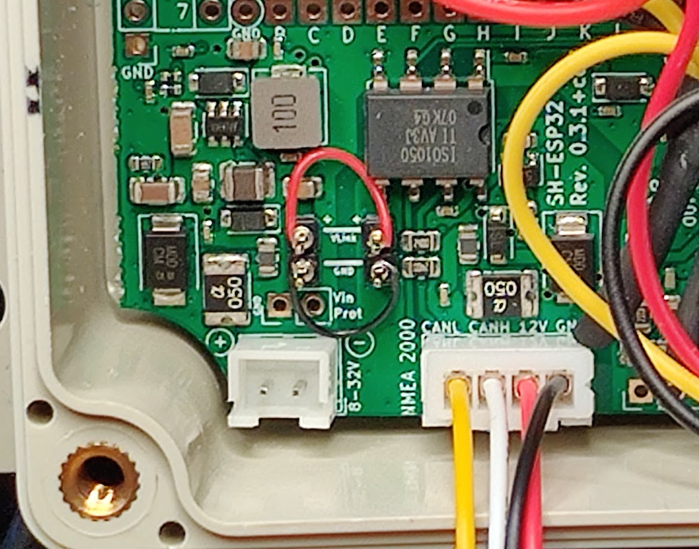{:width="50%"}

The wire link headers are normally unpopulated. Short the wire link plus and GND pins as indicated by the lines. Shorting can be done by soldering a short piece of wire directly on the headers, or as I did, by adding header pins and then connecting the pins using [wire wrap](https://en.wikipedia.org/wiki/Wire_wrap). (I absolutely *love* wire wrap!)

[^1]:

    Actually, 1-Wire is ideally constructed as a bus, with a long trunk from which shorter drop cables are split off. 
    However, for shorter cable lengths, as in our case, it is safe to think of the network topology as a very short bus (zero-length, even) with slightly longer drop cables.

#### Alternative wiring scheme

The crude mockup photo shows an alternative, and possibly better, wiring scheme for the 1-Wire connectors.

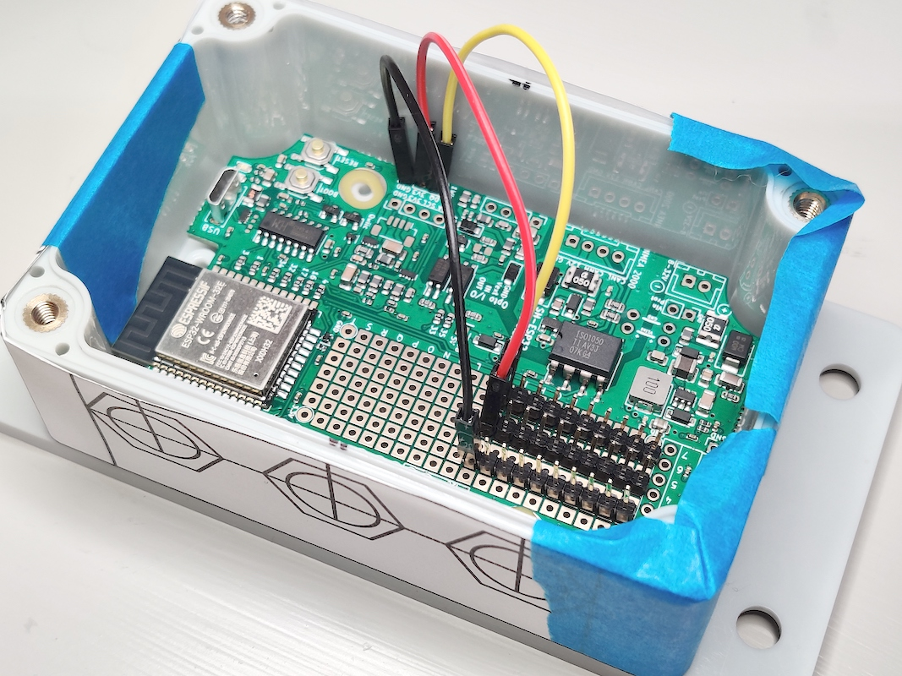{:width="50%"}

In this approach, you solder header strips on the SH-ESP32 proto area and short the pins of each row together on the bottom side of the board. 
The header strips form bus bars of sorts for each 1-Wire pin.

### Assembly

Assuming that the 1-Wire data connectors are already in place, wiggle the SH-ESP32 board to the enclosure and fasten it with the small 3x6 mm screws. 
Then mount the power (or NMEA 2000) connector and connect everything to the board to the respective connectors.

If you're going to use an OLED display, now is the time to mount it.

My own end result is shown below.

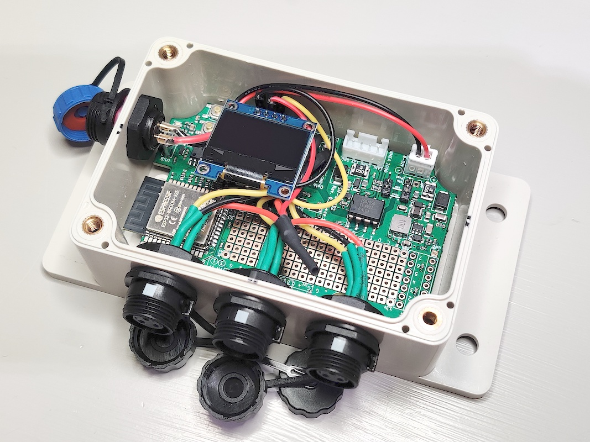{:width="50%"}

Final installation of the sensors on the engine itself is discussed later in this tutorial.

## Software

### Prerequisites

Prerequisites are the same as for the [NMEA 2000 gateway](../nmea2000-gateway): you need to have Visual Studio Code and PlatformIO as well as drivers for the CH340 USB serial chip. 
Refer to that tutorial for installing them.

### Downloading

Download the software from [https://github.com/hatlabs/SH-ESP32-onewire-temperature](https://github.com/hatlabs/SH-ESP32-onewire-temperature). 
You can either clone the repo (if you're comfortable with Git) or download the source code as a zip file by clicking on the green "Code" button and selecting "Download ZIP".
Unzip the package and open the directory in Visual Studio Code (File -> Open Workspace). 

### Code modifications

The example project assumes three sensors for engine oil, engine coolant, and engine wet exhaust temperature, respectively.
If you have a different number of sensors or are measuring different things, you need to modify the program. 
Open the `src/main.cpp` file in Visual Studio Code.

The sensors are defined in `main.cpp` around line 97. 
Modify the configuration paths and the variable names according to your liking.

Metadata for the sensor Signal K outputs are defined beginning from line 106. 
That defines the human-readable descriptions and value units for the Signal K paths.

The sensors are then connected to Signal K outputs around line 137. 
Again, you can modify the Signal K paths according to your preferences. 
It is advisable to try to follow the [Signal K specification](http://signalk.org/specification/1.5.0/doc/vesselsBranch.html) for the path names, but if you can't find anything fitting, feel free to invent your own.

In the example, coolant temperature value is connected to two paths: `propulsion.main.temperature` and `propulsion.main.coolantTemperature`. Coolant temperature is typically regarded the overall engine temperature, but there is also a specific path defined for it. This slight redundancy guarantees that both paths are specified, should a downstream process expect either of them.

If you are using the OLED display, you want to modify the display outputs around line 170. 
Those define how the temperature values are displayed on the small OLED screen.

You might at this point be already wondering about the temperature units.
Both Signal K and NMEA 2000 use Kelvins internally, and that is what SensESP uses as well.
The idea is that everything is internally processed in standard SI units and conversion to customary units such as °C or °F is performed only when displaying the values.
SensESP normally would never convert Kelvins to °C or °F, but displaying values on the OLED screen is that single big exception to the rule: the displayed values should be converted to customary units.

The tutorial software shows the temperatures by default in Celsius.
If you want to have your temperatures in Fahrenheit, go back and modify the lines 29 and 30 accordingly.

#### NMEA 2000 data

Modifying the NMEA 2000 output is, due to the nature of the protocol, a somewhat more complex task.
NMEA 2000 sends data in [fixed-format messages](https://en.wikipedia.org/wiki/NMEA_2000#Message_format_and_parameter_group_numbers_(PGNs)).
The message type is defined by its PGN (Parameter Group Number).
Each PGN can contain one or more pieces of data.
For example, PGN 130312 "Environmental Parameters" includes water temperature, outside ambient air temperature, and atmospheric pressure all in on message.
In most PGNs, individual values can also be marked as undefined -- in the above example, if we only have air temperature, we can avoid sending bogus data by marking water temperature and atmospheric pressure as undefined.

One good source for PGNs and PGN structures is the `canboat` library [PGN definition header file](https://github.com/canboat/canboat/blob/master/analyzer/pgn.h).
This can be cross-referenced with the [NMEA 2000 message list](https://github.com/ttlappalainen/NMEA2000/blob/master/src/N2kMessages.h) of the NMEA 2000 library used to compile and transmit the messages.
Search the file for the PGN number or the data type you want to send and you'll likely find some information on the topic.

Generic temperature data is provided by PGNs 130310, 130311, 130312 and 130316.
Engine temperature data is provided by PGN 127489 "Engine Parameters, Dynamic" and transmission data by PGN 127493 "Transmission Parameters, Dynamic".

In this tutorial, we're transmitting engine oil (sump) temperature, coolant temperature, and wet exhaust temperature.
Some might be more interested in the actual exhaust gas temperature, but those go way above the capabilities of the 1-Wire sensors we're using and need to be measured with a specially fitted thermocouple probe.
PGN 127489 transmits both oil temperature and coolant temperature, so we have to collect the values and send them together.
The approach I took in this example is that the temperature values are stored in a variable, and whenever either oil or coolant temperature is updated, a PGN 127489 is always sent.
The wet exhaust temperature is sent separately using PGN 130312.

To change the PGN mapping, you will have to modify the code around lines 62 and 219.

## Sensor configuration

Each 1-Wire sensor contains a unique hardware address.
When the program first starts, it assigns newly detected sensor addresses to `OneWireTemperature` sensor objects and saves the information in the flash memory.
The device scan order is arbitrary, so if all sensors are connected at once, they are assigned to `OneWireTemperature` objects in a random order.
The assignments can be modified through the web configuration UI, but there's an easier way: connect the sensors one by one.

The example program defines `OneWireTemperature` objects in the following order: oil, coolant, exhaust. Hence, do this:

1. Connect the sensor that will become the oil temperature sensor.
2. Power on the device for a few seconds.
3. Power off the device.
4. Connect the coolant temperature sensor.
5. Power on the device for a few seconds.
6. Power off the device.
7. Connect the exhaust temperature sensor.
8. Power on the device.
9. Done!

Following this approach guarantees that the sensors are registered in the correct order.

## Testing

Test your device before installing it on the boat. If there are any issues with your setup, it's a lot easier to fix them before everything has been firmly attached in place.

### Signal K

If you are using the device with Signal K, you need to connect it to your Signal K server. If you haven't set up one yet, follow the [Signal K server installation instructions](https://github.com/SignalK/signalk-server).

 You could set the Wi-Fi and server information in the code, but this tutorial relies on automatic (Bonjour/mDNS/DNS-DD/Avahi) service discovery.

After powering up, if the device hasn't been configured yet, a wireless access point named "Configure temperatures" should appear.
If you connect to it, you should be automatically taken to the WiFiManager configuration screen.
If that doesn't happen, open the browser and navigate to http://192.168.4.1/.
Select the Wi-Fi network you normally use and enter the password.
The device should now automatically connect to the network.

If you have automatic service discovery correctly configured, you should immediately have a device access request appear on the Signal K server web UI:

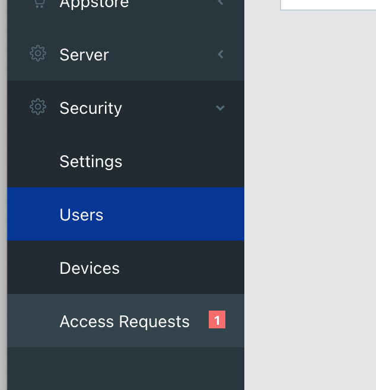{:width="50%"}

Open the access request, set authentication timeout to "NEVER", and click Approve. 
You should immediately get new data on the Signal K server dashboard and data browser.

SensESP device on the dashboard:

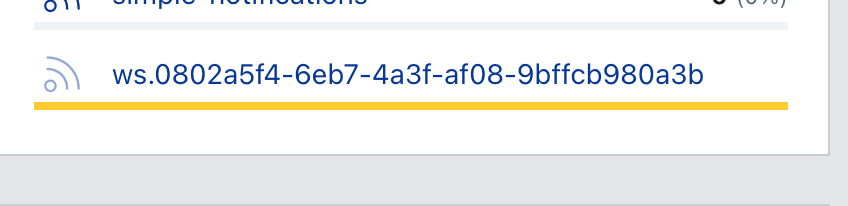

Temperature readings on the data browser:

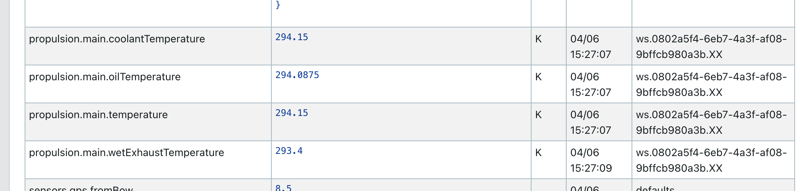

### NMEA 2000

To test NMEA 2000 connectivity, plug your device into your NMEA 2000 network. 
Assuming you have a chart plotter on the network, you should be able to get the device list with the new temperature sensor on it:

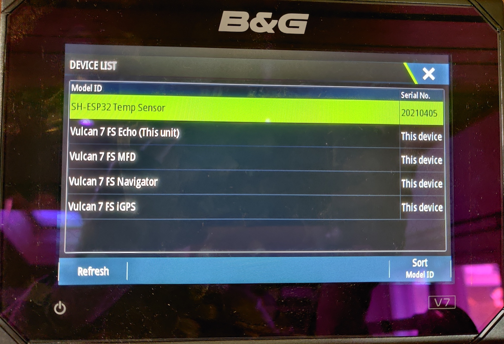{:width="50%"}

If the SH-ESP32 device data is inspected, it should show three different temperature values:

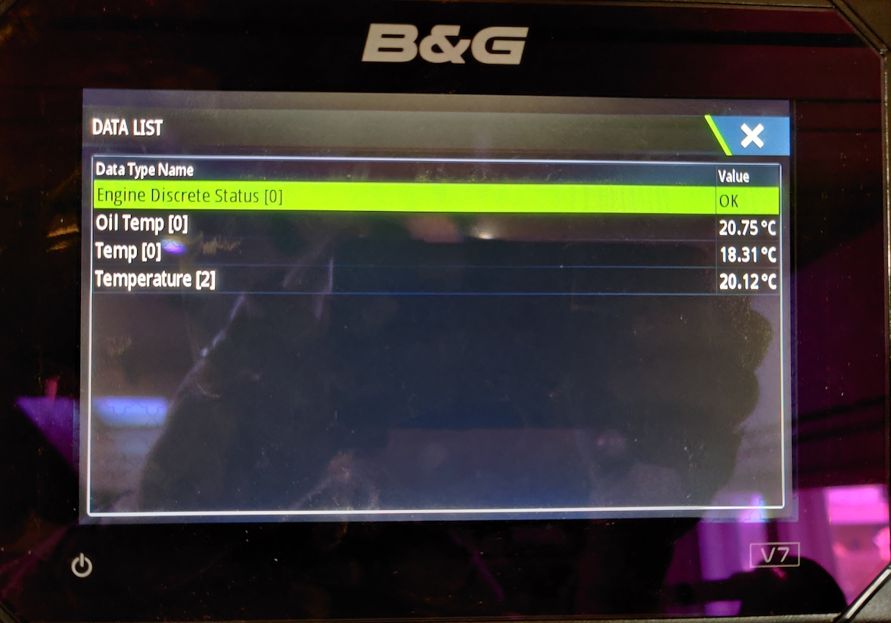{:width="50%"}

This verifies that the connection is working.

## Sensor installation on boat

All that remains is to install the device and the sensor cables on the boat.
I didn't want to do permanent modifications to my Yanmar 3GM30F diesel engine.
My sensor installation was very much a low-tech one, but nevertheless quite functional. 
The oil temperature sensor went to the side of the engine oil pan. 
There was a threaded bolt hole on the oil pan. 
I took a suitably sized square washer and bent one corner slightly, then used that to secure the sensor against the oil pan. 
When doing this, take care to not tighten the bolt too hard, as that will likely crush the sensor.

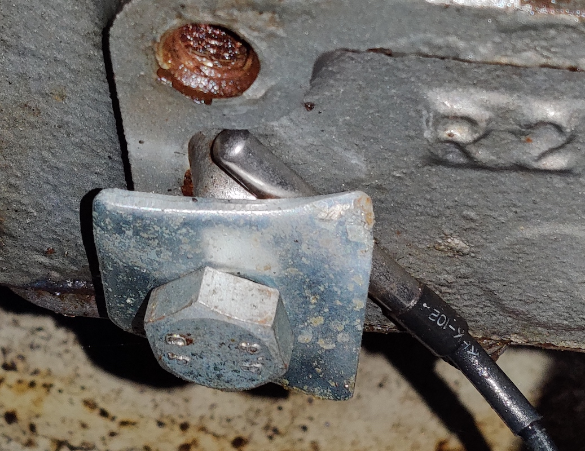{:width="50%"}

The coolant temperature is measured on the surface of the coolant return hose. 
The sensor is first taped on with silicone tape. 
Silicone tape can sustain high temperatures, is a very good insulator, and is self fusing, providing a secure seal around the hose and the sensor. 
Nevertheless, I would still add a hose clamp over the tape to ensure that the cable can't get loose and fall onto the engine belts.

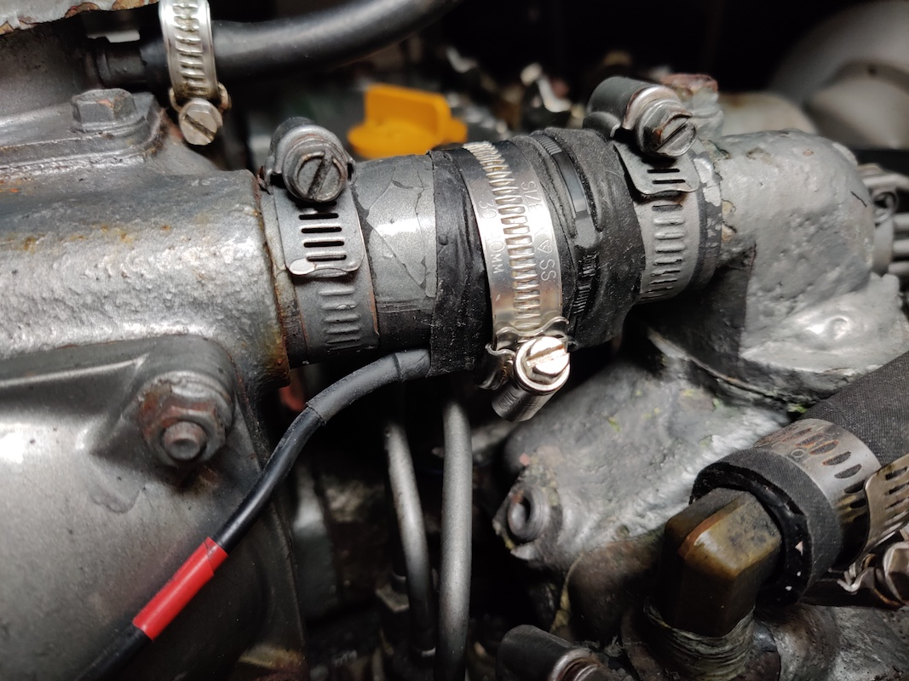{:width="50%"}

The exhaust sensor went onto the exhaust bend, after the coolant water hose connection. 
Similar to the coolant temperature sensor, I attached it with silicone tape and a hose clamp.

{:width="50%"}

For all sensors, take care to route the cables neatly. 
There should be some slack to allow for engine vibrations, but otherwise the cables should be mounted on some fixtures every 30 cm (1 ft) or so.
At no point should the cable be able to chafe against the vibrating engine. 
Also, be careful not to allow the cable touch very hot parts of the engine such as the exhaust manifold.

Congratulations! 
You now have a fancy new temperature sensor for your engine!
Time to go brag online and to your marina neighbors!
